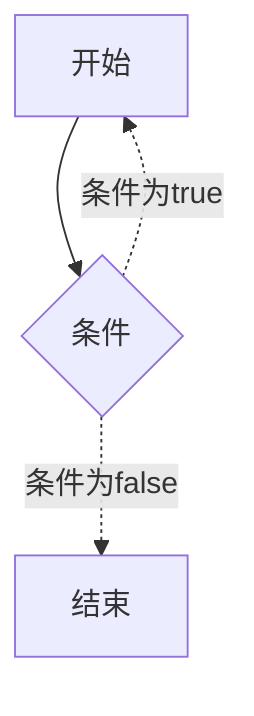

# C 循环

> 我们需要多次执行同一块代码.

---

---

# 循环类型
| 循环类型 | 描述 |
| -------- | ---- |
| `while` | 当条件为真时，重复语句或语句组 |
| `for` | 多次执行一个语句序列，简化管理循环变量的代码 |
| `do...while` | 除了它是在循环主体结尾测试条件外，其他与 while 语句类似 |
| 嵌套循环 | 每个嵌套或者被嵌套 |

# 循环控制语句
| 控制语句 | 描述 |
| -------- | ---- |
| `break` | 终止循环或 `switch` 语句 |
| `continue` | 	告诉一个循环体立刻停止本次循环迭代，重新开始下次循环迭代 |
| `goto` | 将控制转移到被标记的语句   ***但是不建议在程序中使用 goto 语句*** |

