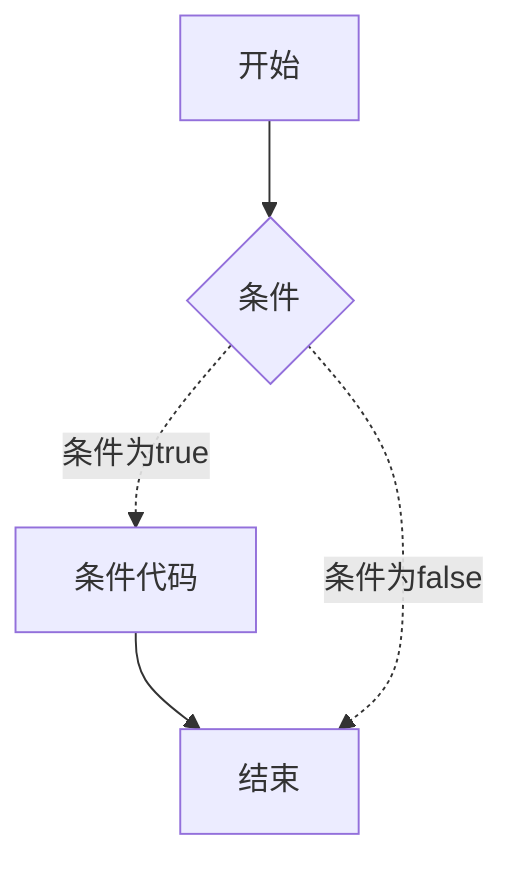

# C 判断

判断结构要求程序员指定一个或多个要评估或测试的条件 <br> 以及条件为真时要执行的语句（必需的）<br> 条件为假时要执行的语句（可选的）

---



---

| 语句 | 描述 |
| ---- | ---- |
| `if` |  一个 `if` 由一个布尔表达式后跟一个或多个语句组成 |
| `if...else` | 每个 `if` 后面都可以跟上 `else` |
| 嵌套 `if` | 可以在一个 if 或 else if 语句内使用另一个 if 或 else if 语句 | 
| `switch` | 一个 switch 语句允许测试一个变量等于多个值时的情况 |
| 嵌套 `switch` | 您可以在一个 switch 语句内使用另一个 switch 语句 |


# ? : 运算符(三元运算符)
这个可以替代 `if...else`。一般格式:
```c
exp1 ? exp2 : exp3;
```
exp1,2,3 是表达式. 如果 `exp1` 为 `true`, 执行 `exp2`, 否则执行 `exp3`

